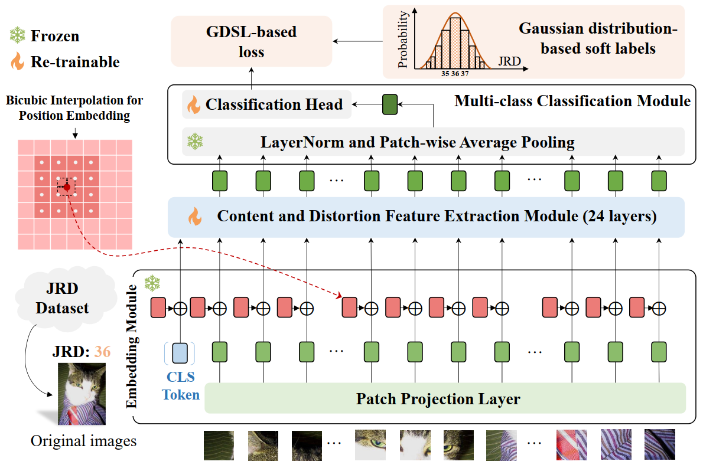

# DT-JRD
DT-JRD: Deep Transformer-based Just Recognizable Difference Prediction Model for Video Coding for Machines
[paper](#) [code](#)  
[Junqi Liu](https://github.com/JunqiLiu-SYSU), [Yun Zhang](https://codec.siat.ac.cn/yunzhang/), [Xiaoqi Wang](https://github.com/XiaoqiWang), [Long Xu](https://scholar.google.com.sg/citations?hl=en&user=PBqivgkAAAAJ&view_op=list_works&sortby=pubdate), [Sam Kwong](https://scholars.ln.edu.hk/en/persons/sam-tak-wu-kwong)
*IEEE Transactions on Multimedia (TMM), 2025*

# DT-JRD
DT-JRD: Deep Transformer-based Just Recognizable Difference Prediction Model for Video Coding for Machines \
[[paper]](https://arxiv.org/abs/2411.09308) [[code]](https://github.com/JunqiLiu-SYSU/DT-JRD) \
[Junqi Liu](https://github.com/JunqiLiu-SYSU), [Yun Zhang](https://codec.siat.ac.cn/yunzhang/), [Xiaoqi Wang](https://github.com/XiaoqiWang), [Long Xu](https://scholar.google.com.sg/citations?hl=en&user=PBqivgkAAAAJ&view_op=list_works&sortby=pubdate), [Sam Kwong](https://scholars.ln.edu.hk/en/persons/sam-tak-wu-kwong) \
*IEEE Transactions on Multimedia (TMM), 2025*

## Abstract
Just Recognizable Difference (JRD) represents the minimum visual difference that is detectable by machine vision, which can be exploited to promote machine vision-oriented visual signal processing. In this paper, we propose a Deep Transformer-based JRD (DT-JRD) prediction model for Video Coding for Machines (VCM), where the accurately predicted JRD can be used to reduce the coding bit rate while maintaining the accuracy of machine tasks.
Firstly, we model the JRD prediction as a multi-class classification and propose a DT-JRD prediction model that integrates an improved embedding, a content and distortion feature extraction, a multi-class classification, and a novel learning strategy. 
Secondly, inspired by the perception property that machine vision exhibits a similar response to distortions near JRD, we propose an asymptotic JRD loss by using Gaussian Distribution-based Soft Labels (GDSL), which significantly extends the number of training labels and relaxes classification boundaries.
Finally, we propose a DT-JRD-based VCM to reduce the coding bits while maintaining the accuracy of object detection.
Extensive experimental results demonstrate that the mean absolute error of the predicted JRD by the DT-JRD is 5.574, outperforming the state-of-the-art JRD prediction model by 13.1\%.
Coding experiments show that compared with the VVC, the DT-JRD-based VCM achieves an average of 29.58\% bit rate reduction while maintaining the object detection accuracy.
<p align="center">
  
</p>

## Requirements


## Train
<pre> ``` python train.py --size 384 --epochs 20 --batchsize 32 --lr 0.01 --gpus 0,1 --device cuda:0 ``` </pre>
